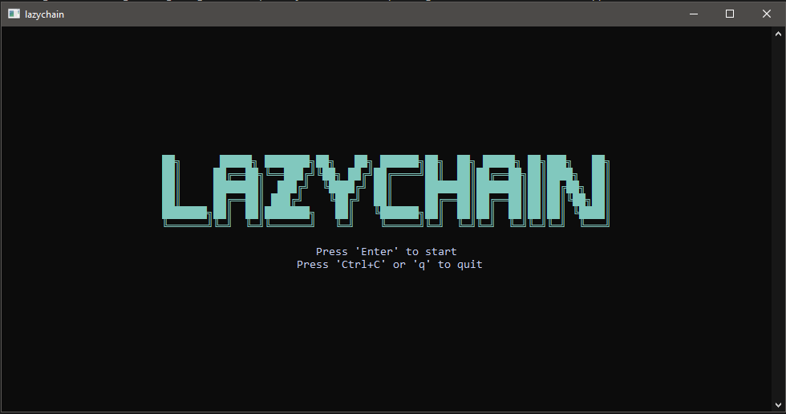
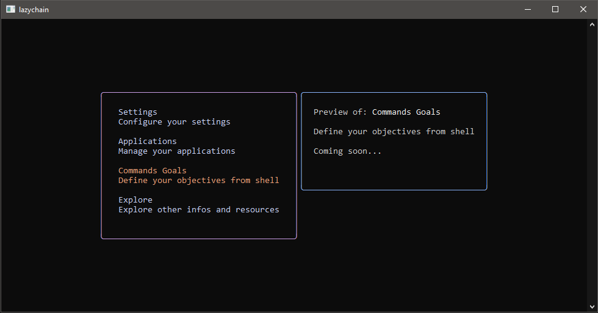

# LazyChain

**LazyChain** is a terminal-based user interface (TUI) that lets you interact with the [Algorand blockchain](https://www.algorand.com/) directly from your terminal.

Built with [BubbleTea](https://github.com/charmbracelet/bubbletea) and the official [Algorand Go SDK](https://github.com/algorand/go-algorand-sdk), LazyChain makes exploring accounts, transactions, applications, and network status fast and intuitive — no browser required.

---

## 📥 Installation
### Download the executable
Download the latest binary (lazychain.exe or lazychain) directly from the root of the repository:

```bash
# For Windows
wget https://github.com/VKappaKV/lazy-chain/raw/main/lazychain.exe -O lazychain.exe
chmod +x lazychain.exe

# For Linux/macOS (if a Unix binary is available)
wget https://github.com/VKappaKV/lazy-chain/raw/main/lazychain -O lazychain
chmod +x lazychain
```

### Clone the repository
If you prefer to build or inspect the source code
```bash
git clone https://github.com/VKappaKV/lazy-chain.git
cd lazy-chain
```
---

## ✨ Features

- View accounts, transactions, and applications
- Connect to different Algorand networks (MainNet, TestNet, etc.)
- Interact with smart contracts (TEAL) (soon)
- Configure and persist network settings
- Lightweight and responsive terminal UI

---

## 📸 Preview




---

## 🗂️ Repository Structure

- **lib/**: Core logic for interacting with the Algorand Go SDK.
- **models**/: Definitions of data structures (accounts, transactions, applications).
- **misc/**: Utility functions, parsing, and CLI configuration.
- **preview/**: Demonstrative screenshots of the TUI interface.
- **main.go**: Entry point that sets up BubbleTea and launches the application.
- **lazychain.exe / lazychain**: Precompiled executable ready to use.


---

## 🛠️ Built With

- **Go** – Programming language
- **BubbleTea** – TUI framework by Charm
- **Algorand Go SDK** – Official SDK for blockchain interaction

---

## 📄 License

This project is licensed under the MIT License.

---
