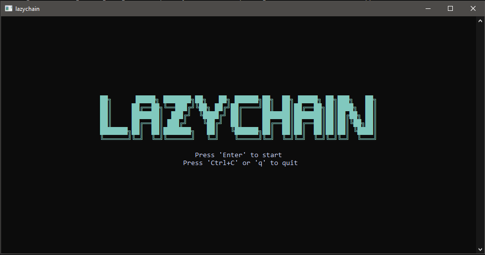
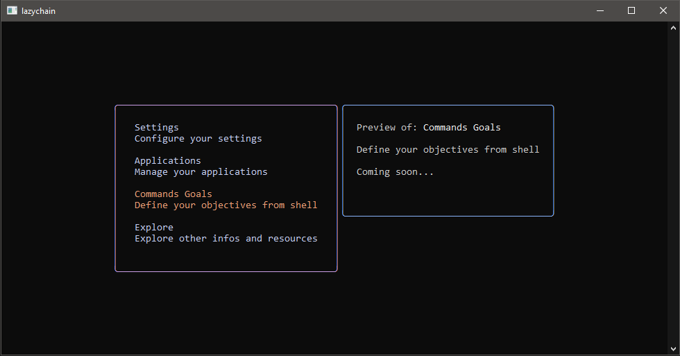

# LazyChain

**LazyChain** is a terminal-based user interface (TUI) that lets you interact with the [Algorand blockchain](https://www.algorand.com/) directly from your terminal.

Built with [BubbleTea](https://github.com/charmbracelet/bubbletea) and the official [Algorand Go SDK](https://github.com/algorand/go-algorand-sdk), LazyChain makes exploring accounts, transactions, applications, and network status fast and intuitive — no browser required.

---

## ✨ Features

- View accounts, transactions, and applications
- Connect to different Algorand networks (MainNet, TestNet, etc.)
- Interact with smart contracts (TEAL) (soon)
- Configure and persist network settings
- Lightweight and responsive terminal UI

---

## 📸 Preview

---

## 🛠️ Built With

- **Go** – Programming language
- **BubbleTea** – TUI framework by Charm
- **Algorand Go SDK** – Official SDK for blockchain interaction

---
